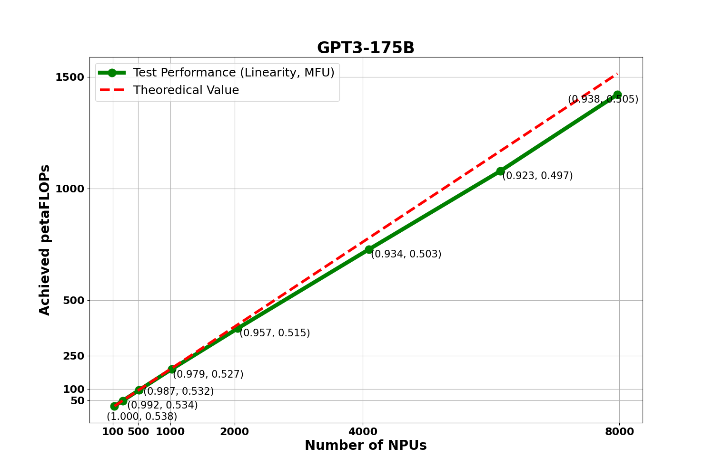

## MindSpeed-LLM Docs 目录

<table>
  <thead>
    <tr>
      <th>内容</th>
      <th>链接</th>
      <th>备注</th>
    </tr>
  </thead>
  <tbody>
    <tr>
      <td rowspan="1">环境安装指导</td>
      <td><a href="pytorch/install_guide.md">install_guide.md</a></td>
      <td></td>
    </tr>
    <tr>
      <td rowspan="1">快速入门</td>
      <td><a href="./quick_start.md">quick_start.md</a></td>
      <td>基于pytorch/mindspore后端的入门指导，从环境安装到预训练拉起</td>
    </tr>
    <tr>
      <td rowspan="3">仓库支持模型清单</td>
      <td><a href="pytorch/models/dense_model.md">dense_models</a></td>
      <td>稠密模型清单</td>
    </tr>
    <tr>
      <td><a href="pytorch/models/moe_model.md">MOE_models</a></td>
      <td>MOE模型清单</td>
    </tr>
    <tr>
      <td><a href="pytorch/models/ssm_model.md">SSM_models</a></td>
      <td>SSM模型清单</td>
    </tr>
    <tr>
      <td rowspan="1">特性清单</td>
      <td rowspan="1"><a href="pytorch/features/">features</a></td>
      <td rowspan="1">收集了部分仓库支持的性能优化和显存优化的特性</td>
    </tr>
    <tr>
      <td rowspan="4">模型前处理操作</td>
      <td rowspan="1"><a href="pytorch/solutions/checkpoint_convert.md">checkpoint_convert</a></td>
      <td rowspan="1">支持legacy、mcore、hf、lora等各种不同格式权重间的部分转换路径</td>
    </tr>
    <tr>
      <td rowspan="1"><a href="pytorch/solutions/pretrain/pretrain_dataset.md">pretrain_dataset</a></td>
      <td rowspan="3">支持的数据集格式包括<a href="pytorch/solutions/finetune/datasets/alpaca_dataset.md">alpaca</a>,<a href="pytorch/solutions/finetune/datasets/pairwise_dataset.md">pairwise</a>,<a href="pytorch/solutions/finetune/datasets/sharegpt_dataset.md">sharegpt</a></td>
    </tr>
    <tr>
      <td rowspan="1">finetune_dataset(待补充)</td>
    </tr>
    <tr>
      <td rowspan="1"><a href="pytorch/solutions/preference-alignment/process_reward_dataset.md">reward_dataset</a></td>
    </tr>
    <tr>
      <td rowspan="2">预训练方案</td>
      <td><a href="pytorch/solutions/pretrain/pretrain.md">pretrain</a></td>
      <td>多样本预训练方法</td>
    </tr>
    <tr>
      <td><a href="pytorch/solutions/pretrain/pretrain_eod.md">pretrain_eod</a></td>
      <td>多样本pack预训练方法</td>
    </tr>
    <tr>
      <td rowspan="5">模型微调方法</td>
      <td rowspan="1"><a href="pytorch/solutions/finetune/instruction_finetune.md">instruction_finetune</a></td>
      <td rowspan="1">模型全参微调方案</td>
    </tr>
    <tr>
      <td rowspan="1"><a href="pytorch/solutions/finetune/multi_sample_pack_finetune.md">multi_sample_pack_finetune</a></td>
      <td rowspan="1">多样本Pack微调方案</td>
    </tr>
    <tr>
      <td rowspan="1"><a href="pytorch/solutions/finetune/lora_finetune.md">lora_finetune</a></td>
      <td rowspan="1">模型lora微调方案</td>
    </tr>
    <tr>
      <td rowspan="1"><a href="pytorch/solutions/finetune/qlora_finetune.md">qlora_finetune</a></td>
      <td rowspan="1">模型qlora微调方案</td>
    </tr>
    <tr>
      <td rowspan="1"><a href="pytorch/solutions/finetune/multi-turn_conversation.md">multi-turn_conversation</a></td>
      <td rowspan="1">多轮对话微调方案</td>
    </tr>
    <tr>
      <td rowspan="3">模型推理方法</td>
      <td rowspan="1"><a href="pytorch/solutions/inference/inference.md">inference</a></td>
      <td rowspan="1">模型推理</td>
    </tr>
    <tr>
      <td rowspan="1"><a href="pytorch/solutions/inference/chat.md">chat</a></td>
      <td rowspan="1">对话</td>
    </tr>
    <tr>
      <td rowspan="1"><a href="pytorch/features/yarn.md">yarn</a></td>
      <td rowspan="1">使用yarn方案来扩展上下文长度，支持长序列推理</td>
    </tr>
    <tr>
      <td rowspan="3">模型评估</td>
      <td><a href="pytorch/solutions/evaluation/evaluation_guide.md">evaluation</a></td>
      <td rowspan="1">模型评估方案</td>
    </tr>
    <tr>
      <td><a href="pytorch/models/models_evaluation.md">evaluation_baseline</a></td>
      <td rowspan="1">仓库模型评估清单</td>
    </tr>
    <tr>
      <td><a href="pytorch/solutions/evaluation/evaluation_datasets">evaluation_datasets</a></td>
      <td rowspan="1">仓库支持评估数据集</td>
    </tr>
    <tr>
      <td rowspan="3">模型偏好训练方法</td>
      <td rowspan="1"><a href="pytorch/solutions/preference-alignment/offline_dpo.md">offline_dpo</a></td>
      <td rowspan="1">基于数据偏好训练模型，但不会使用policy-model进行推理并参与其权重更新</td>
    </tr>
    <tr>
      <td rowspan="1"><a href="pytorch/solutions/preference-alignment/simpo.md">simpo</a></td>
      <td rowspan="1">简单偏好训练优化方法</td>
    </tr>
    <tr>
      <td rowspan="1"><a href="pytorch/solutions/preference-alignment/trl_ppo.md">trl_ppo</a></td>
      <td rowspan="1">强化学习优化策略方法</td>
    </tr>
    <tr>
      <td rowspan="2">奖励模型方案</td>
      <td><a href="pytorch/solutions/preference-alignment/process_reward_model.md">process_reward_model</a></td>
      <td rowspan="1">过程奖励模型</td>
    </tr>
    <tr>
      <td><a href="pytorch/solutions/preference-alignment/outcome_reward_model.md">outcome_reward_model</a></td>
      <td rowspan="1">结果奖励模型</td>
    </tr>
  </tbody>
</table>

【线性度性能展示】

基于 `GPT3-175B` 稠密大模型，从128颗 NPU 扩展到 7968颗 NPU 进行 MFU 与线性度实验，下图是实验数据：

  

图中呈现了对应集群规模下的 `MFU` 值与集群整体的 `线性度`情况. 计算公式已经放到社区，点击链接可进行参考：[MFU计算公式](https://gitee.com/ascend/ModelLink/wikis/%E6%9C%AF%E8%AF%AD%E5%AE%9A%E4%B9%89/%E5%A4%A7%E6%A8%A1%E5%9E%8B%20MFU%20%E8%AE%A1%E7%AE%97%E5%85%AC%E5%BC%8F)，[线性度计算公式](https://gitee.com/ascend/ModelLink/wikis/%E6%9C%AF%E8%AF%AD%E5%AE%9A%E4%B9%89/%E7%BA%BF%E6%80%A7%E5%BA%A6%E5%85%AC%E5%BC%8F).